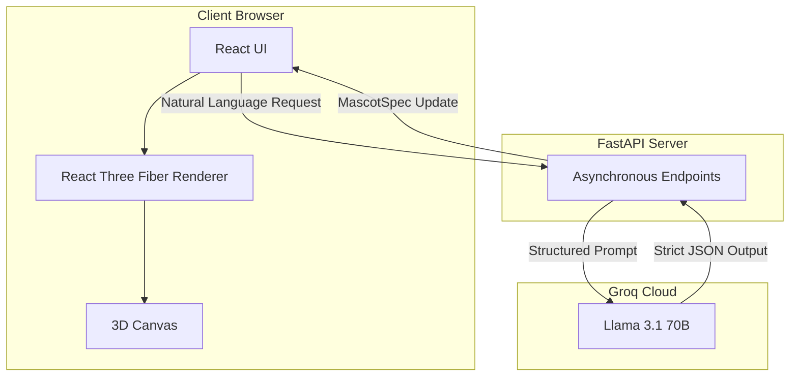

# MascotForge

MascotForge is a local-first, AI-powered utility that generates declarative, customizable 3D mascots for React applications using Llama 3.1 and React Three Fiber. It empowers developers to instantly design, animate, and export production-ready interactive 3D components directly into their codebases in seconds.

---

## Key Features

### 1. Agentic AI Refinement ("AI X-Ray" Mode)
- **Feature:** A dedicated "AI Refine" chat interface allows users to naturally describe changes to their mascot (e.g., "Make it look like a robot").
- **Engineering:** Utilizes a **Structured prompt engineering pipeline**. The system enforces strict JSON schema generation via Llama 3.1, translating natural language directly into `MascotSpec` updates.
- **Explainability:** Built-in "Developer X-Ray" mode exposes the raw system prompt, schema constraints, and live JSON diffs to demonstrate the underlying AI orchestration.

### 2. Declarative 3D Rendering Engine
- **Feature:** Real-time 3D preview of the mascot with customizable body shapes, primitive assemblies, materials (glass, neon, soft toy), and physics-based animations.
- **Engineering:** Built from scratch using **React Three Fiber**. The `MascotEngine` interprets the JSON spec into a dynamic React component graph, featuring **optimized rendering using geometry reuse and memoization to maintain smooth interactive performance.**

### 3. Event-Driven Behavior System
- **Feature:** Mascots react to user behavior on the host website.
- **Engineering:** A custom hook (`useMascotEvents`) binds DOM events (Scroll Percentage, Idle Time, Exit Intent, Network Offline) to mascot animations and dialogue triggers, bringing the character to life without heavy performance overhead.

### 4. Client-Side Code Generation & Export
- **Feature:** Instant export of the mascot for integration into any codebase.
- **Engineering:** Fully client-side templating engine that generates ready-to-use React (`.jsx`) components and Python dictionaries. It also generates hyper-specific LLM prompts injected with the mascot's unique personality and traits.

### 5. Resilient Offline-First Architecture
- **Feature:** The application can function entirely without a backend, making it perfect for static hosting.
- **Engineering:** All database endpoints feature robust `localStorage` fallbacks, ensuring the Gallery, Library, and Project Saving functionalities remain 100% operational in a serverless environment.

---

## Architecture



---

## Tech Stack

### Frontend & 3D
- **React.js (Vite):** High-performance UI rendering and state management.
- **React Three Fiber / Three.js:** Declarative 3D graphics, lighting, and primitive rendering.
- **Tailwind CSS:** Utility-first styling with custom glassmorphism and animations.
- **Lucide React:** Consistent, scalable SVG iconography.

### AI Core & Backend
- **Groq API (Llama 3.1 70B):** Sub-second inference for JSON schema generation.
- **FastAPI (Python):** Lightweight **asynchronous endpoints** for highly concurrent API orchestration.
- **Docker & Docker Compose:** Containerized microservices architecture for seamless local development and deployment.
- **Security:** API keys are stored strictly in environment variables (`.env`) and are never exposed client-side.

---

## Folder Structure

```text
mascot-forge/
├── frontend/
│   ├── src/
│   │   ├── components/
│   │   │   ├── Editor/       # UI controls for Appearance, Behaviors, AI Refine
│   │   │   ├── Export/       # Client-side code generation logic
│   │   │   └── Preview/      # MascotEngine.jsx (React Three Fiber renderer)
│   │   ├── hooks/
│   │   │   ├── useMascotSpec.js    # Global state management for the mascot
│   │   │   └── useMascotEvents.js  # DOM event listeners for mascot triggers
│   │   ├── lib/
│   │   │   ├── api.js              # API wrappers with LocalStorage fallback
│   │   │   └── exampleMascots.js   # Pre-configured diverse mascot templates
│   │   ├── App.jsx           # Main application routing and UI shell
│   │   └── index.css         # Tailwind directives and custom UI animations
│   ├── package.json
│   └── vite.config.js
├── backend/
│   ├── main.py               # FastAPI application and asynchronous routes
│   ├── models.py             # Pydantic schemas and database models
│   ├── database.py           # SQLite database connection
│   ├── .env                  # Environment variables (Securely stores GROQ_API_KEY)
│   └── requirements.txt
├── docker-compose.yml        # Orchestration for frontend and backend
├── Dockerfile.frontend
└── Dockerfile.backend
```

---

## Technical Challenges Overcome

1. **JSON Schema Adherence:** LLMs often struggle with strict structural requirements. I solved this by engineering a highly constrained system prompt combined with structured output formatting, guaranteeing that the AI's response perfectly matches the `MascotSpec` interface expected by the 3D renderer.
2. **3D Performance:** Rendering multiple dynamic materials and lights in the browser can be heavy. I optimized `MascotEngine.jsx` by reusing geometries where possible and leveraging `useFrame` for procedural animations instead of heavy keyframe data.
3. **Hybrid State Management:** Balancing the need for a robust backend database with the flexibility of a static portfolio piece. I implemented a seamless try-catch fallback layer in `api.js` that degrades gracefully to `localStorage` when the FastAPI server is unreachable.

---

## Future Scope

- **Multi-agent mascot refinement:** Specialized agents for text generation vs. 3D modeling.
- **Voice interaction:** Real-time WebRTC audio processing to talk with the mascot.
- **RAG-powered mascot personality:** Injecting corporate knowledge bases so the mascot can answer domain-specific questions.
- **Blender export:** `.obj`/`.gltf` compilation for external animation software.
- **Multi-mascot collaboration:** Rendering multiple interactive agents on the same canvas.
- **Animation timeline editor:** Keyframe-level UI for users to design bespoke animations beyond the built-in library.
